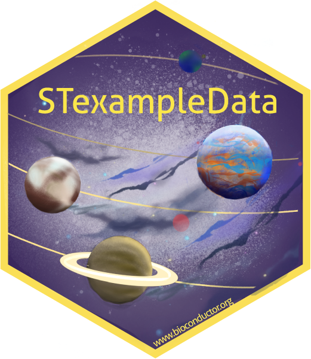

# STexampleData

[](https://github.com/lmweber/STexampleData/actions)



The `STexampleData` package contains a collection of spatial transcriptomics datasets, which have been formatted into the [SpatialExperiment](https://bioconductor.org/packages/SpatialExperiment) Bioconductor class, for use in examples, demonstrations, and tutorials. The datasets are from several different technological platforms and have been sourced from various publicly available sources. Several datasets include images and/or reference annotation labels.

The `STexampleData` package is available from [Bioconductor](https://bioconductor.org/packages/STexampleData).

A vignette containing examples and documentation is also available from [Bioconductor](https://bioconductor.org/packages/STexampleData).


## Installation

The current release version of the `STexampleData` package can be installed from Bioconductor as follows. This is the recommended installation for most users.

```
install.packages("BiocManager")
BiocManager::install("STexampleData")
```

For advanced users who require any latest updates, the development version can also be installed from the `devel` version of Bioconductor (see the Bioconductor website for details on how to use the `devel` version), or from GitHub as follows:

```
install.packages("remotes")
remotes::install_github("lmweber/STexampleData")
```


## Citation

- Righell D.\*, Weber L.M.\*, Crowell H.L.\*, Pardo B., Collado-Torres L., Ghazanfar S., Lun A.T.L., Hicks S.C.\*, and Risso D.\* (2022). *SpatialExperiment: infrastructure for spatially resolved transcriptomics data in R using Bioconductor.* [Bioinformatics](https://academic.oup.com/bioinformatics/advance-article/doi/10.1093/bioinformatics/btac299/6575443), btac299.
